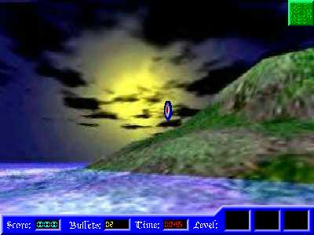



## Duck Hunt Game

### Description

This Code is a 2D mouce game sample. it looks like the game duckhunt but has 5 targets, that you must shoot: Standard Target, Duck, Worm, Ghost and U.F.O. You meet a new enemy after score 50.
 
### More Info
 
No inputs

A game

No side effect

             |
---                |---
**Submitted On**   |2002-02-15 21:03:30
**By**             |[Lefteris Eleftheriades](https://github.com/Planet-Source-Code/PSCIndex/blob/master/ByAuthor/lefteris-eleftheriades.md)
**Level**          |Intermediate
**User Rating**    |5.0 (35 globes from 7 users)
**Compatibility**  |VB 4\.0 \(32\-bit\), VB 5\.0, VB 6\.0
**Category**       |[Games](https://github.com/Planet-Source-Code/PSCIndex/blob/master/ByCategory/games__1-38.md)
**World**          |[Visual Basic](https://github.com/Planet-Source-Code/PSCIndex/blob/master/ByWorld/visual-basic.md)
**Archive File**   |[Duck\_Hunt\_570142232002\.zip](https://github.com/Planet-Source-Code/lefteris-eleftheriades-duck-hunt-game__1-31847/archive/master.zip)

### API Declarations

Too many

